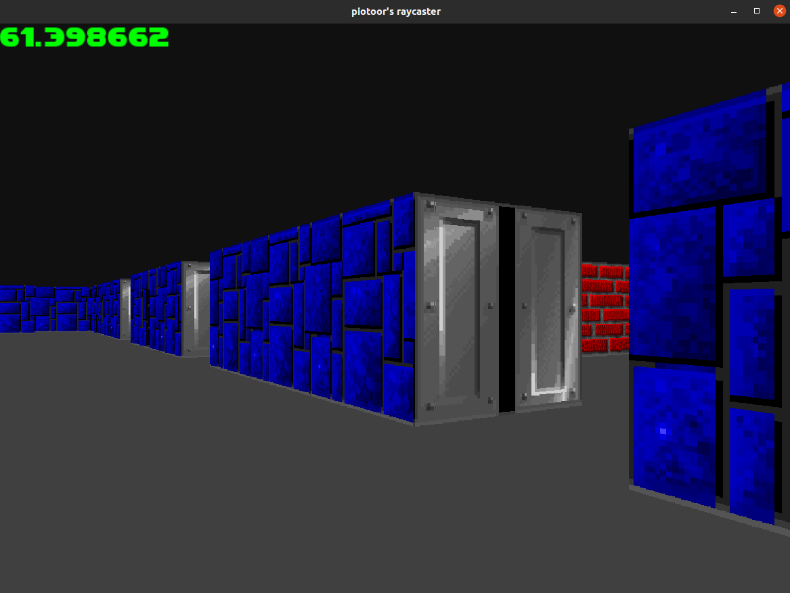

## Table of contents
* [General info](#general-info)
* [Technologies](#technologies)
* [Setup](#setup)
* [Features](#features)
* [Status](#status)

## General info
This project is a simple raycaster engine written in C++ using SFML library.



### Assets
Currently I'm using slightly modified Wolfenstein 3D textures.

## Technologies
* C++
* SFML

## Setup
### Linux
Clone the repo:
```
git clone https://github.com/piotoor/sfmlRaycaster.git
```
Install SFML library:
```
sudo apt-get install libsfml-dev
```

You may also need to install make and cmake:
```
sudo apt-get install build-essential
sudo apt-get install cmake
```

Go to the root directory of sfmlRaycaster project and build:
```
mkdir build
cd build
cmake ../src
make
```

Now you can run the engine:
```
./sfmlRaycaster
```

## Features
You can walk around the map using arrow keys.

## Status
Project is in progress. Implementing enemies.
